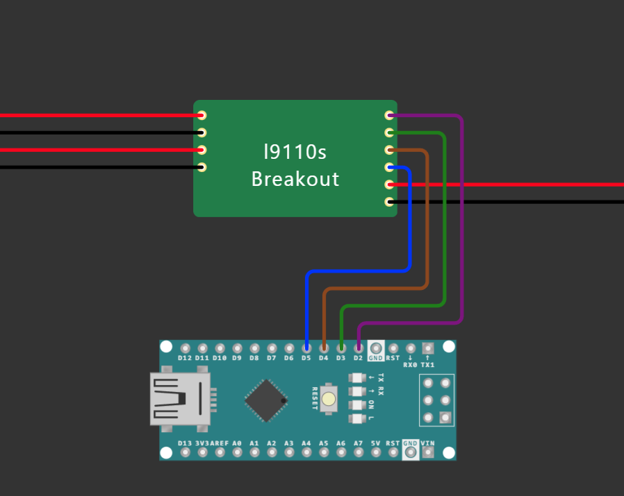

# Hebocon

Herzlich Willkommen zum HOKO Weeks InterFace Hebocon Event.
 
Ein Hebocon ist ein Roboterkampf. Wer jetzt allerdings an ein Duell futuristischer und bis an die Zähne bewaffneter Maschinen denkt, wird leider enttäuscht. Denn das Wort ”heboi” stammt aus dem Japanischen und bedeutet so viel wie “minderwertig” oder “peinlich”. Und genau das macht einen Hebocon auch aus. Ein Konstrukt zählt als Hebocon, wenn es sich bewegt (mechanisch oder elektrisch), nicht größer als 50 x 50 cm ist und nicht mehr als ein Kilogramm wiegt.
 
Aus zur Verfügung gestellten Schrott-Teilen z.B. Ränder, Platinen, Sensoren, Metallplatten etc. werden Roboter gebaut, die auf Basis einer Code-Basis gesteuert werden. Gebastelt wird an beiden Workshop-Tagen.
 
Highlight ist das Turnier am zweiten Tag (ab 14:30 Uhr) mit Siegerehrung und Preisverleihung.

## Anleitung

In dieser Anleitung erfährst du mehr darüber wie du deinen Roboter Bauen und Programmieren kannst. 

## Motorsteuerung

Die Software für die Motorsteuerung befindet bereits sich in den [Steuerungsprogrammen](#steuerung). Das bedeutet du musst lediglich die Motorsteuerung wie in dem Bild dargestellt anschließen und eine [Steuerungsart](#steuerung) wählen.

## Kommunikation

Zuerst solltest du eine art der Kommunikation mit deinem Roboter wählen. Zur auswahl stehen:

- Kabellos [nRF24L01](communication/RF/README.md)
- Kabelgebunden [USB](communication/Cable/README.md)

Die links führen zu weiteren Readme Dateien welche die einrichtung der Kommunikationsschnittstellen erklären.

## Steuerung

Beide [Kommunikationskanäle](#kommunikation) können für beide der folgenden Steuerungsarte verwented werden:

- [Gestensteuerung](steering/gestures/README.md)
- [Tastatur](steering/keyboard/README.md)
