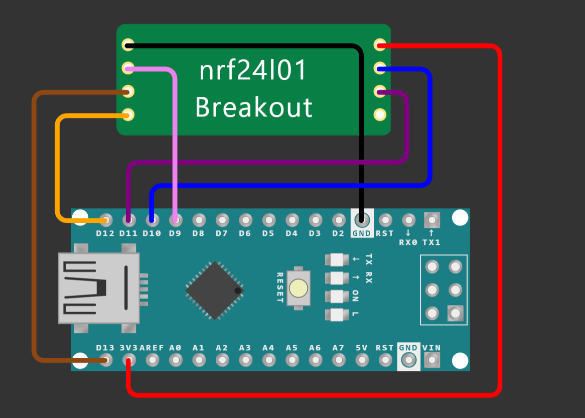

# Kabellose Komminikation
## Aufbau
<ins>__Falls ein RF-Nano verwendet wird, wird kein NRF24L01 Chip benötigt!__</ins>

Für die Kabellose Kommunikation mit dem Roboter wird ein nRF24L01 verwndet. Die ser muss wie in dieser Schaltung beschrieben an den Arduino des Roboters angeschlossen werden:

## Software
Auf den besagten Arduino muss dann das [reciever](reciever/README.md) Programm geladen werden damt er mit einem anderen Arduino mit Wireless Kommunikation und dem [sender](sender/README.md) Programm kommunizieren kann.